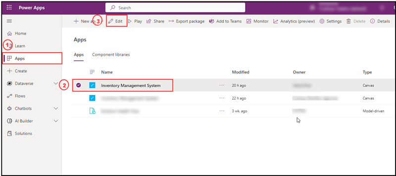
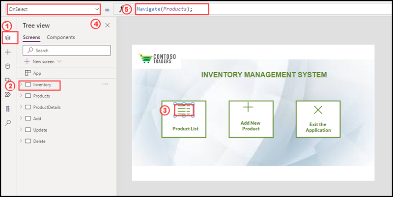
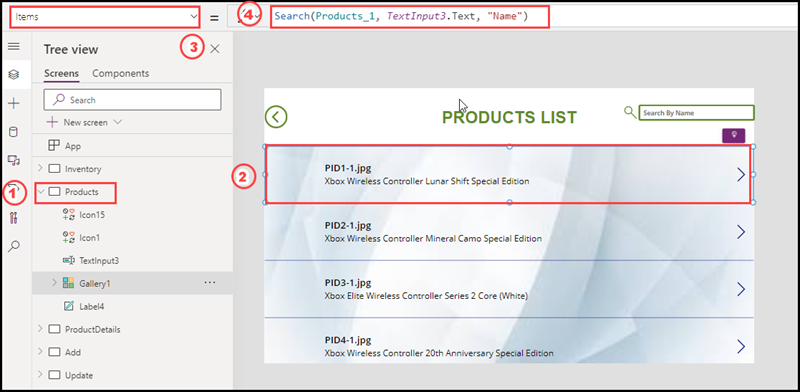
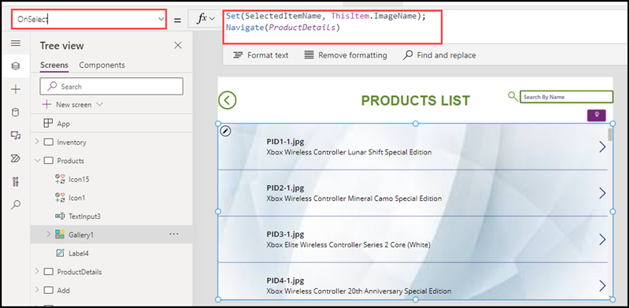
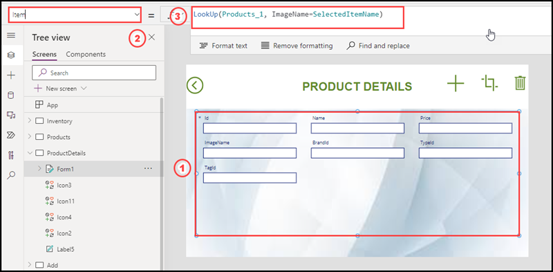
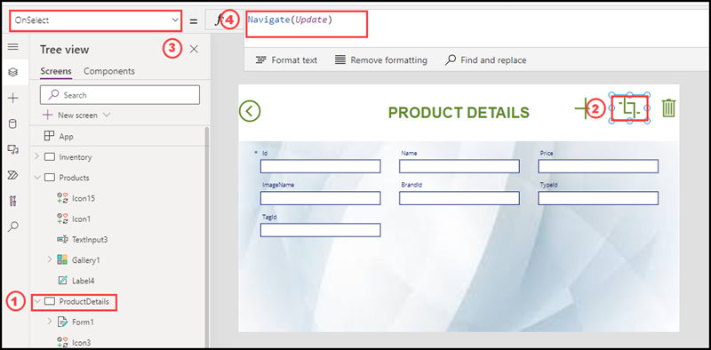
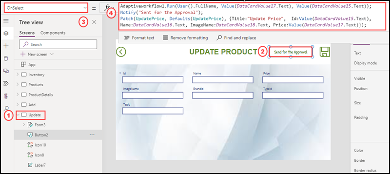
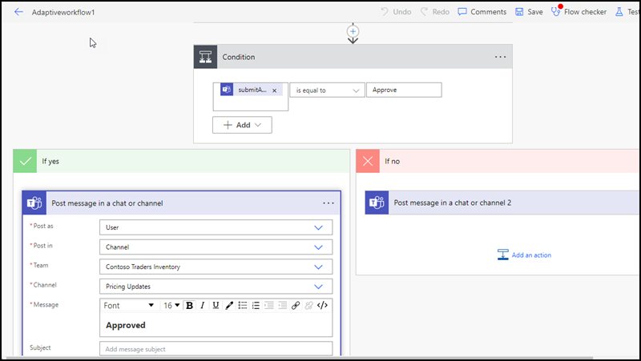
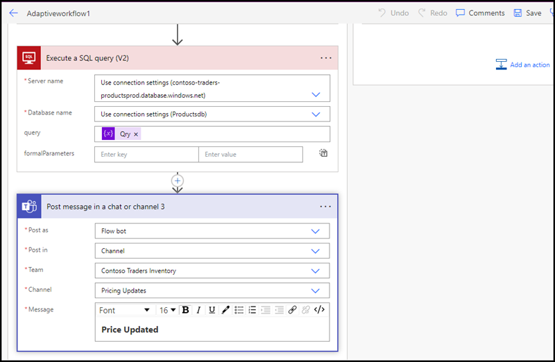
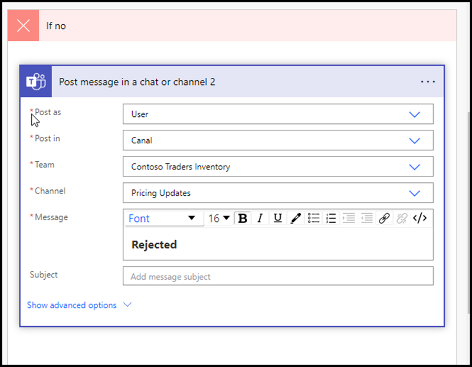

# Low Code Development – Canvas App with Power Automate : Overview

Power platform helps to build the Inventory Management System App for resolving the issues in the current scenario of Contoso Traders. It enables the collaborations internally. Two main components of Power platform were used to build the application viz, PowerApp and Power Automate. Lets walkthrough each component and how its configured. 

## Key Takeaways

The Key takeaways from this demo are: 

* Power Apps is used to help developers and business users to build custom solutions to meet business goals as it is a Low-Code approach to development. How effectively with a simple canvas contoso traders resolved their issue
* Canvas App configuration and screens coding explained
* Canvas app used a dataverse connection with Azure SQL database by configuring SQL Server connection from the Power App Dataverse connections.
* Canvas App used Power automate workflow with adaptive cards to send the notifications to a Teams channel by using bot.
* Adaptive cards can be used to send notifications or messages to the audience by using bot or message extension.

## Before you begin

You must have Inventory Management System App deployed in your Power platform environment. If you have not deployed it yet, please refer the [documentation](https://github.com/seenakhan/ContosoTraders/blob/main/docs/Inventory-power-app-deployment-guide.md).

## Walkthrough - Power App 

Inventory Management System App was built in Canvas App by using cloud database connectivity. Databases are kept in Azure SQL Database. We can use the app for CRUD operations. In Contoso Traders they need the Update operation through an automation process, before update the price of any product the stakeholders should approve and once it get approved the price will updated automatically. Based on this scenario the App built. Lets go through some of the screens in detail and explore how its configured and what are the scripts and formulas applied.    
  
      
1. Login into the Power platform with your Microsoft 365 user account. 

2. After login into the Power platform select the environment where the Inventory Management System App imported.

3. Select Apps and Select Inventory Management App, then click on Edit from the top side.

   

4. It will open Power app studio where you can see the number screens added,  the details of connections and the workflow.

5. Select the first screen named Inventory and select the list icon and on the left top side from the dropdown list select OnSelect and see the formula added. This formula is for when a user click on the product list it will navigate to Products Screen. 
   

6. Product List screen will show all the products in a vertical gallery. Select the vertical gallery and on the left top side Select Items from the dropdown list and see the formula added there. This formula will list the entire data from the table Products of the Azure SQL database productsdb. Also a user can search the product by its name on the search box.

   

7.Select the Onselect of the Vertical gallery in the same screen, see the formula added there. A variable created and it stored the value of item selected by the user from the gallery. Also it will navigate to ProductDetails screen.

      
  
8. On the Product Details Screen select the form, then select Item property from the dropdownlist on hte top left side. This formula is for displaying the selected item stored from the variable.

  

  
9. Select the ProductDetails screen select update icon, then select onselect property from the dropdown on the top left side, see the formula. This formula is for navigating to the Update screen. 
   
   

      
10. On the UPdate screen select “Send for Approval” button configure a workflow named “Adaptiveworkflow1”. Also the product details to be updated will be fetched into a SharePoint list named “UpdatePrice”.
       
   
    
       
 11. After clicking on the “Send for the Approval” button, it will trigger a notification message of Approval request into Microsoft Teams channel named "Pricing Updates" on the Teams named “Contoso Traders Inventory”. It has been configured by using Adaptive cards.

          
  
       
 12. In this Approval request Adaptive card we can see three buttons, one is for View Items, when the stakeholder click on view item it will redirect to a SharePoint list having the details of the product to be updated. Another two buttons are for Approve and Reject. When the Stakeholder click on Reject it will pass a message in the channel “Rejected”. When the stakeholder click on Approve it will pass a message in the channel “Approved” and immediately after a while another message will comes “Price updated”.
       
   
       
 Also it will automatically updated the price in the website as well as database.

## Walk through - POWER AUTOMATE

Let’s walkthrough the workflow named “Adaptiveworkflow1”. Here the requirement is when a business user trying to update the price of any product, it should automate an approval request to a Teams Channel and the stakeholder can approve it. To build the workflow Power automate tool has been used.

1. An instant cloud workflow has been created.

   
        
In this workflow three variables initialized with values submitted by, submitted on and an update T-SQL query respectively.
           
   
   
   
        
After that configured “Post an Adaptive card and wait for response” flow. In this flow, configured an Adaptive card in json script and pass value of two variables submitted on and submitted by into the adaptive card. 

** Refer the Adaptive card json file [here](https://github.com/seenakhan/ContosoTraders/blob/main/iac/Adaptivecard.json).** 

After that a Condition control flow configured with a condition body(‘PostAdaptiveCardToChannelAndWaitforaresponse’)[‘submitActionId’] is equal to Approve. Along with the condition If Yes and IF No flows also configured When the stakeholder click on the Approve button then the If yes flow will execute. It has additional three flows added two flows are for passing the message on the Teams channel and One flow is for calling the variable having T-SQL update query. Below are the images shows the If Yes flow configuration.

    
  
    
And for the If No flow configured a Post message in a chat or channel 2. Below image shows the same:

  

## Summary

With Power platform tools any complex business scenarios can be configured and deployed easily. We can do more use cases by using various functionalities of Power platform tools.

## Additional Reading

[Create a Canvas App](https://learn.microsoft.com/en-us/power-apps/maker/canvas-apps/get-started-test-drive)

[Adding workflows to Canvas App
](https://learn.microsoft.com/en-us/power-apps/maker/canvas-apps/using-logic-flows)

[Configure Adaptive Card by using Adaptive card designer](https://adaptivecards.io/designer/)
      
      
      
